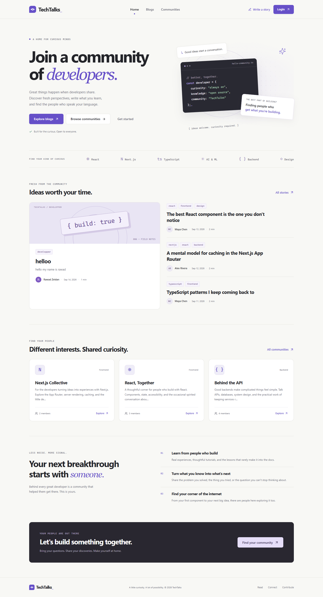

# TechTalks

TechTalks is a full-stack developer community platform where developers can publish technical articles, discover and join communities, and manage their developer profiles.

## Live Demo

[Open TechTalks](https://techtalks-sigma.vercel.app)

Public pages and the production MongoDB connection are verified. Production sign-in still needs the canonical URL corrected and both OAuth providers tested. Follow the [GitHub and Vercel guide](docs/DEPLOYMENT.md) and [submission checklist](SUBMISSION_CHECKLIST.md).

## Screenshots



| Page              | Screenshot                                                                           |
| ----------------- | ------------------------------------------------------------------------------------ |
| Homepage          | [View](docs/screenshots/home.png)                                                    |
| Authentication    | [View](docs/screenshots/login.png)                                                   |
| Blogs             | [View](docs/screenshots/blogs.png)                                                   |
| Blog Details      | [View](docs/screenshots/blog-details.png)                                            |
| Communities       | [View](docs/screenshots/communities.png)                                             |
| Community Details | [View](docs/screenshots/community-details.png)                                       |
| Profile           | Real account capture pending; see [capture instructions](docs/screenshots/README.md) |

Public screenshots use the running application and Atlas content at a consistent 1440 × 1000 desktop viewport. Authenticated integration-test images are separate from portfolio screenshots. A [demo script](docs/DEMO_SCRIPT.md) is included.

## Features

- Google and GitHub OAuth, protected profiles, and sign-out.
- Markdown articles with preview, publishing, private drafts, editing, and deletion.
- Blog search, topic filters, related articles, and author information.
- Community discovery, creation, member previews, and persistent join/leave actions.
- Editable profiles with bio, GitHub/portfolio links, authored stories, and memberships.
- Responsive navigation, keyboard focus, loading, error, empty, and missing-page states.
- Server Components, ISR, Route Handlers, Server Actions, and Zod validation.

## Tech Stack

Next.js 16 App Router, React 19, TypeScript, Tailwind CSS 4, Auth.js / NextAuth v5 beta, MongoDB Atlas, Mongoose 8, Zod 4, Lucide, React Markdown, and remark-gfm. Playwright and an isolated MongoDB process support integration tests. Exact versions are in `package-lock.json`.

## Architecture

Server Components query MongoDB directly. Client Components handle navigation state, search, forms, previews, and authentication buttons. Server Actions and JSON Route Handlers share validation and authorization through `lib/services.ts`.

```text
app/                 Pages, layouts, loading/error states, and API routes
actions/             Authenticated form mutations and cache invalidation
components/          Shared UI and feature components
lib/                 Auth, connection caching, queries, services, schemas, DTOs
models/              Mongoose User, Blog, and Community models
scripts/             Seed, integration tests, and screenshot capture
tests/               Validation and redirect regression tests
types/               Auth.js session and JWT type extensions
docs/                Deployment, manual tests, demo script, and screenshots
```

Public routes are `/`, `/blogs`, `/blogs/[slug]`, `/communities`, `/communities/[slug]`, and `/login`. Protected routes are `/profile`, `/blogs/new`, `/blogs/[id]/edit`, and `/communities/new`. The editor's filesystem segment is named `[slug]` to share the dynamic route level; it receives a MongoDB ID.

## Rendering Strategy

| Route                  | Strategy                                                                                      |
| ---------------------- | --------------------------------------------------------------------------------------------- |
| `/`                    | Server Component with 60-second ISR                                                           |
| `/blogs`               | Server Component with `revalidate = 60`; client-side filtering                                |
| `/blogs/[slug]`        | Dynamic URL, on-demand static generation and 60-second ISR; article metadata and `notFound()` |
| `/communities`         | Server Component with 60-second ISR                                                           |
| `/communities/[slug]`  | Dynamic server rendering for membership state                                                 |
| `/profile` and editors | Dynamic server rendering; private data never enters a shared page cache                       |
| `/login`               | Dedicated dynamic page; never automatically displayed on the homepage                         |

Successful mutations invalidate dependent pages. Public pages read database records, not seed arrays. A streamed missing page can return HTTP 200 with `noindex` and the not-found UI; non-streamed missing routes and missing API records return 404.

## Database Models

| Model     | Main fields                                                         | Relationships and constraints                         |
| --------- | ------------------------------------------------------------------- | ----------------------------------------------------- |
| User      | name, email, image, provider, oauthId, bio, githubUrl, portfolioUrl | Unique email; sparse unique provider/account identity |
| Blog      | title, slug, excerpt, content, tags, published, timestamps          | `author` references User; unique slug                 |
| Community | name, slug, description, category, tags, timestamps                 | `createdBy` and `members` reference User; unique slug |

Mongoose shares a cached connection promise and resets failed attempts. Membership uses atomic `$addToSet` and `$pull` updates. Creation paths initialize indexes; duplicate slugs produce a conflict response.

## Authentication

Auth.js handles Google/GitHub OAuth, encrypted JWT sessions, authentication CSRF protection, and logout. First sign-in creates a MongoDB User; later sessions load the current profile. Every protected mutation derives identity from the verified session.

Google email must be verified. Provider and provider account ID identify users. An email already registered with another provider is not silently linked: use the original provider. Seed authors cannot log in. OAuth tokens and secrets are not stored in application records or exposed to the browser.

## API Endpoints

| Method     | Route                        | Purpose                                    | Authentication                         |
| ---------- | ---------------------------- | ------------------------------------------ | -------------------------------------- |
| GET        | `/api/blogs`                 | List published articles                    | Public                                 |
| POST       | `/api/blogs`                 | Create an article or draft                 | Required                               |
| GET        | `/api/blogs/[id]`            | Read an article by ID                      | Public if published; author for drafts |
| PATCH      | `/api/blogs/[id]`            | Update article fields                      | Author only                            |
| DELETE     | `/api/blogs/[id]`            | Delete an article                          | Author only                            |
| GET        | `/api/communities`           | List communities                           | Public                                 |
| POST       | `/api/communities`           | Create and join a community                | Required                               |
| POST       | `/api/communities/[id]/join` | Join a community                           | Required                               |
| DELETE     | `/api/communities/[id]/join` | Leave a community                          | Required                               |
| GET        | `/api/me`                    | Read private profile, stories, memberships | Required                               |
| GET / POST | `/api/auth/[...nextauth]`    | Authentication endpoints                   | Managed by Auth.js                     |

Responses use `{ data: ... }` or `{ error: { code, message, fields? } }`. Status codes include 200/201, 400 for invalid input, 401 for missing sessions, 403 for ownership/origin violations, 404 for missing/private records, 409 for duplicate slugs, and sanitized 500 responses. APIs use session cookies and `Cache-Control: no-store`. JSON mutation bodies are limited to 150 KB. Public DTOs exclude email and OAuth identity.

## Environment Variables

Copy `.env.example` to `.env.local` and fill values locally. The template contains names only:

```dotenv
MONGODB_URI=
MONGODB_DNS_SERVERS=
NEXTAUTH_SECRET=
NEXTAUTH_URL=
GOOGLE_CLIENT_ID=
GOOGLE_CLIENT_SECRET=
GITHUB_CLIENT_ID=
GITHUB_CLIENT_SECRET=
```

`MONGODB_URI` includes the database name. `NEXTAUTH_SECRET` is a random session secret; `NEXTAUTH_URL` is the canonical origin. Provider variables come from their OAuth applications.

`MONGODB_DNS_SERVERS` is optional: comma-separated DNS server IPs for networks that refuse Atlas SRV lookups. Leave it unset in production unless needed. It changes DNS only within the Node process.

Auth.js also recognizes `AUTH_SECRET` and `AUTH_URL`; use the documented `NEXTAUTH_*` names consistently. Vercel is recognized as a trusted host. A trusted self-hosted reverse proxy may require `AUTH_TRUST_HOST`; do not enable it for arbitrary untrusted forwarding.

## Getting Started

Use Node.js 24 and npm:

```sh
git clone https://github.com/Rawad-01/techtalks.git techtalks
cd techtalks
npm ci
```

Create the environment file once, preserving any existing configured file:

```powershell
Copy-Item .env.example .env.local
```

On macOS/Linux, use `cp .env.example .env.local`. Configure MongoDB and OAuth. Generate a session secret locally:

```sh
node -e "console.log(require('node:crypto').randomBytes(32).toString('base64url'))"
```

## Running Locally

```sh
npm run seed
npm run dev
```

Open [http://localhost:3000](http://localhost:3000). Restart after environment changes. Public browsing does not require login. Without database configuration, public pages show empty states; connection failures show recovery UI.

## Database Setup

1. Create a MongoDB Atlas cluster and an application user with read/write permission for the intended database.
2. Allow your current development IP in Atlas Network Access.
3. Copy **Connect → Drivers** into `MONGODB_URI`. Replace placeholder brackets, include the database name, and URL-encode reserved password characters.
4. Run `npm run seed` to initialize indexes and sample content.

Mongoose uses Node.js. Production networking is covered in [DEPLOYMENT.md](docs/DEPLOYMENT.md); integration tests use an isolated local MongoDB process.

## Google OAuth Setup

1. Configure Google Auth Platform branding and audience; create a Web application client.
2. Set local origin `http://localhost:3000` and redirect URI `http://localhost:3000/api/auth/callback/google`.
3. Save the distinct client ID and secret in `GOOGLE_CLIENT_ID` and `GOOGLE_CLIENT_SECRET`.
4. Configure test users as required by the project's audience/consent settings.
5. Configure the deployed HTTPS origin and `/api/auth/callback/google` redirect for production.

Save a client secret when created; use **Add Secret** when a replacement is needed. See [Google's setup guide](https://support.google.com/cloud/answer/15549257?hl=en).

## GitHub OAuth Setup

1. Open GitHub **Settings → Developer settings → OAuth Apps** and register an application.
2. Set homepage `http://localhost:3000` and callback `http://localhost:3000/api/auth/callback/github`.
3. Save `GITHUB_CLIENT_ID` and `GITHUB_CLIENT_SECRET` in `.env.local`.
4. Use a separate production OAuth app with the deployed HTTPS homepage and `/api/auth/callback/github` callback.

See [GitHub's OAuth app guide](https://docs.github.com/en/apps/oauth-apps/building-oauth-apps/creating-an-oauth-app).

## Seed Data

```sh
npm run seed
```

The seed adds four fictional editorial authors, seven original articles, and six communities. `$setOnInsert` preserves matching records and user edits. It does not delete collections or create login credentials. Real OAuth sign-in creates your user.

## Build

```sh
npm run lint
npm run typecheck
npm test
npm run build
```

Stop the development server and run `npm start` to use the production build locally. Configure and seed the intended database before building for populated ISR pages.

Run the browser/API suite after building:

```sh
npm run test:integration
```

The suite needs Google Chrome, starts isolated MongoDB and a production server on port 3210, and uses test-only signed Auth.js cookies. It verifies app sessions, APIs, Server Actions, and persistence, but cannot prove external provider consent. It never writes to the configured Atlas database. MongoDB Memory Server downloads an official binary on first use; set `MONGOMS_SYSTEM_BINARY` to an existing executable if needed.

See [verification results](VERIFICATION.md) and [manual tests](docs/MANUAL_TESTING.md).

## Deployment

Push to GitHub and import into Vercel as a Next.js project. Configure production environment variables, Atlas access, and the exact HTTPS OAuth origins/callbacks. Redeploy after configuration changes.

The [deployment guide](docs/DEPLOYMENT.md) provides exact steps. This application requires a server; it cannot use static export or GitHub Pages.

## Security

- Secrets are server environment variables. Git excludes environment files except the empty template, generated output, dependencies, and local artifacts.
- Protected pages and every mutation authenticate on the server. Blog editing/deletion enforces ownership.
- Zod validates inputs; strict schemas reject injected ownership/identity fields. Profile URLs allow HTTP(S).
- API mutations check origin; Auth.js and Next.js protect their authentication/form flows. Error responses omit stack traces and credentials.
- Markdown does not render raw HTML. Public representations exclude private email and OAuth identity.
- Rotate credentials exposed in chats, screenshots, or history. Removing them from a current file does not revoke them or clean Git history.

## Known Limitations

- Public production pages and Atlas reads are verified; production OAuth configuration and authenticated write flows still require verification.
- Auth.js v5 is a beta dependency.
- Discovery queries up to 100 records and filters in the browser; larger datasets need server pagination/search.
- Embedded community membership arrays suit capstone scale rather than very large communities.
- There is no file upload, comment system, moderation console, or application-level rate limiter. Markdown images render descriptions.
- Cross-provider account linking is unavailable; use the original sign-in provider.
